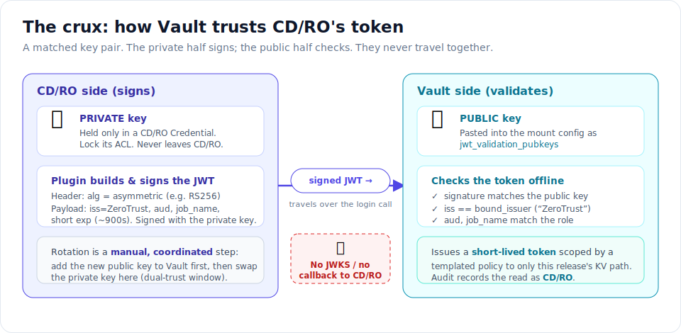
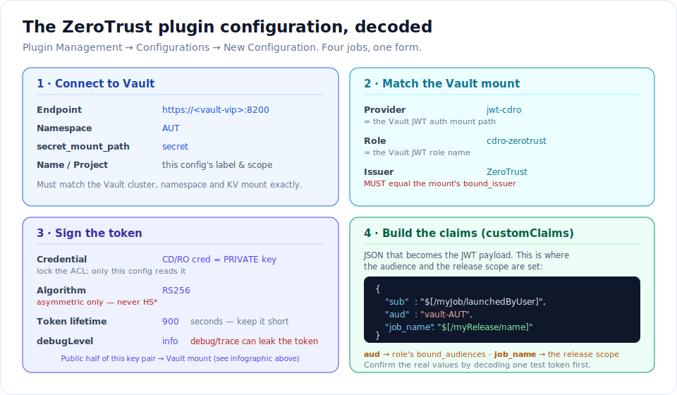

# 01 — Configure the CD/RO ZeroTrust Plugin

**Goal:** make CD/RO able to prove its own identity to Vault. By the end, a CD/RO procedure can mint a
short-lived signed **JWT**, and Vault will trust it and hand back a scoped, short-lived token.

> **👀 Explorer — the one idea.** A JWT is a little signed note that says *"I am this CD/RO release,
> and this note self-destructs in 15 minutes."* The **ZeroTrust plugin** writes and signs that note.
> Vault is taught, once, to recognize the signature. That's the whole job of this guide.

**Tracks:** 👀 Explorer — read the pictures and callouts. 🔧 Operator — do the numbered Steps.
⚙️ Engineer — read the deep-dive boxes and the [reference guide](../vault-integrations/03-cdro-zerotrust-jwt.md).

---

## The crux: signing vs. validating

Before any settings, understand the *shape* of the trust. It's one **key pair**, split in two.



> **👀 Explorer:** think of a wax seal. CD/RO owns the **stamp** (the private key) and presses it into
> every note. Vault owns a **picture of the stamp** (the public key) and checks that the seal on a note
> matches. The stamp never leaves CD/RO; Vault never has to phone CD/RO to check — it already has the
> picture. That "no phone call back" is why this works in an airgapped network.

> **⚙️ Deep-dive — why there's no discovery endpoint.** Unlike CloudBees CI (which exposes an OIDC
> JWKS URL that Vault polls), the ZeroTrust plugin has **no** discovery/JWKS endpoint. Vault validates
> **offline** against a static `jwt_validation_pubkeys` + `bound_issuer="ZeroTrust"`. Consequences:
> there is **no Vault → CD/RO firewall flow**, `oidc_discovery_url` is never set, and
> [`check_oidc_discovery.py`](../../tools/check_oidc_discovery.py) does **not** apply to CD/RO. See the
> [architecture overview §4](../vault-integrations/00-architecture-overview.md#4-firewall-matrix).

---

## Step 0 — Have the key pair ready

The plugin signs with a **private** key; Vault checks with the matching **public** key. Make the pair
once (about 2 minutes, `openssl`, no internet):

→ **[Generate the ZeroTrust signing key pair](../getting-started/03a-zerotrust-key-generation.md)**

You'll end up with two files:

| File | Goes into | Used for |
|---|---|---|
| `zerotrust-private.pem` | a CD/RO **Credential** (Step 1, `Credential` field) | signing the JWT |
| `zerotrust-pub.pem` | the Vault mount (Step 3, `jwt_validation_pubkeys`) | validating the JWT |

> **⚙️ Deep-dive:** use an **asymmetric** algorithm (RS/EC/EdDSA). RSA-3072 → `RS256` is the shipped
> default. Never `HS*` — a shared secret can't be split into a "safe to publish" public half.

---

## Step 1 — Create the plugin configuration

This is where a CD/RO admin tells the plugin *which Vault to talk to, which role to use, how to sign,
and what to put in the token*. Do it once per environment.

**Plugin Management → Configurations → New Configuration → Plugin = ZeroTrust.** The form has four jobs:



> **👀 Explorer:** four groups. **Connect** = the Vault address & namespace. **Match** = names that must
> be spelled identically on both sides. **Sign** = which key and how long the note lives. **Claims** =
> what the note *says* (who I am, which release). If the pictures make sense, you've got it.

**🔧 Operator — fill the form:**

| Field | Set it to | Why |
|---|---|---|
| `Name` | e.g. `vault-aut` | the configuration you reference from procedures |
| `Project` | your CD/RO project | scopes the configuration |
| `Endpoint` | `https://<vault-vip>:8200` | Vault's URL |
| `Role` | `cdro-zerotrust` | the Vault **JWT role** (Step 3) |
| `Provider` | `jwt-cdro` | the Vault JWT auth **mount path** (Step 3) |
| `Issuer` | `ZeroTrust` | **must** equal the mount's `bound_issuer` |
| `customClaims` | see below | JSON that builds the JWT payload |
| `Test Connection Claims` | `{"sub":"test","job_name":"test","aud":"vault-AUT"}` | used by the **Test Connection** button |
| `Token lifetime` | `900` | JWT validity in seconds — keep it short |
| `Credential` | the CD/RO credential holding the **private** key | the plugin signs with this |
| `Algorithm` | `RS256` | must be **asymmetric** |
| `secret_mount_path` | `secret` | the KV v2 mount secrets live under |
| `Namespace` | `AUT` | must equal the Vault namespace |
| `debugLevel` | `info` | `debug`/`trace` can log the JWT or secret values |

**customClaims** builds the payload. The `aud` sets the audience; `job_name` sets the **release scope**:

```json
{
  "sub": "$[/myJob/launchedByUser]",
  "aud": "vault-AUT",
  "job_name": "$[/myRelease/name]"
}
```

- `aud` — a fixed audience string; the Vault role's `bound_audiences` must equal it **exactly**.
- `job_name` — resolves to the running release's name (e.g. `payments-app`); Vault maps it to the secret
  path `cdr/<release>/…`, so each release reads **only its own** secrets.

> **👀 Explorer:** `$[/myRelease/name]` is CD/RO's way of saying "the name of whatever release is
> running right now." At run time the plugin swaps in the real name. That name is the fence around the
> secrets each run is allowed to see.

**✅ Step 1 hardening checklist**

- [ ] `Algorithm` is asymmetric (RS/ES/PS/EdDSA) — never `HS*`.
- [ ] `debugLevel = info` in production.
- [ ] `Credential` (private key) has a tight ACL — only this configuration can read it.
- [ ] `Token lifetime` ≤ 900 s.
- [ ] `Namespace = AUT`, `Issuer = ZeroTrust`.

---

## Step 2 — Capture one real token and confirm its claims

**Never build a Vault role against assumptions.** Emit one real JWT from a *throwaway* procedure and
decode it, so you set `bound_audiences` and the algorithm to what the plugin **actually** produces.

**🔧 Operator:** mint a token into the job log or a property (the plugin's `IssueJwtAndStoreInProperty`
step — [guide 02, Pattern B](02-release-all-use-cases.md#use-case-2--hand-off-to-aap-pattern-b) shows it),
copy the `eyJ…` value, and decode it locally with the airgap-safe helper (no network, no signature check):

```bash
# Paste the token via stdin so it never lands in shell history / argv.
python3 tools/inspect_jwt_claims.py <<'EOF'
eyJhbGciOiJSUzI1NiIsInR5cCI6IkpXVCJ9.<payload>.<sig>
EOF
```

Confirm in the output:

| You should see | Use it for |
|---|---|
| header `"alg": "RS256"` (or ES/PS/EdDSA) | pick the matching **public-key type** for Step 3 |
| `iss = ZeroTrust` | Vault `bound_issuer` |
| `aud = vault-AUT` (or whatever you set) | Vault role `bound_audiences` |
| `job_name = <release>` | Vault role `bound_claims` + `claim_mappings` |
| `sub`, `exp`, `iat` | sanity: `exp − iat ≈ 900 s` |

> **⚠️ Two things to lock down from the real token:** the exact **`aud`** string, and the exact
> **algorithm** + matching **public-key PEM**. Until you've decoded a real token, treat `RS256` and
> `aud=vault-AUT` as placeholders. **Do not use a real production secret to generate this test token.**

---

## Step 3 — Teach Vault to trust the token

The Vault team (or you, if you own `AUT`) applies three things: a **mount** (holds the public key), a
**role** (which tokens are accepted), and a **policy** (what they may read).

> **👀 Explorer:** you can stop reading here — the rest of this step is Vault commands. The takeaway:
> Vault is told the "picture of the stamp," the exact name on the note, and that a note may only open
> its own release's drawer. Nothing more.

**3a — Mount (static public key, no discovery):**

```bash
export VAULT_ADDR="https://<vault-vip>:8200"
export VAULT_NAMESPACE="AUT"
export VAULT_CACERT="/etc/pki/vault/ca.crt"

vault auth enable -path=jwt-cdro jwt
vault write auth/jwt-cdro/config \
    jwt_validation_pubkeys=@/etc/pki/vault/zerotrust-pub.pem \
    bound_issuer="ZeroTrust"
# NOTE: no oidc_discovery_url / jwks_url — the plugin has no discovery endpoint.
```

**3b — Role (bind to the confirmed `aud` and the release claim):**

```bash
vault write auth/jwt-cdro/role/cdro-zerotrust \
    role_type="jwt" user_claim="sub" \
    bound_audiences="vault-AUT" \
    bound_claims_type="glob" bound_claims='{"job_name":"*"}' \
    claim_mappings='{"job_name":"release"}' \
    token_policies="cdro-zerotrust-ro" \
    token_ttl="15m" token_max_ttl="15m"
```

**3c — Policy (KV v2 read-only, release-scoped, templated):**

```bash
vault policy write cdro-zerotrust-ro - <<'EOF'
path "secret/data/cdr/{{identity.entity.aliases.<jwt-cdro-accessor>.metadata.release}}/*" {
  capabilities = ["read"]
}
path "secret/metadata/cdr/{{identity.entity.aliases.<jwt-cdro-accessor>.metadata.release}}/*" {
  capabilities = ["read", "list"]
}
EOF
# Replace <jwt-cdro-accessor> with the mount accessor from: vault auth list -detailed
```

> **⚙️ Deep-dive — what makes this least-privilege.**
> - `user_claim="sub"` → Vault audit attributes the read to **CD/RO**, not a broker.
> - `claim_mappings` copies `job_name` into entity metadata `release`, which the **templated policy**
>   interpolates into `cdr/<release>/*`. The *role* is deliberately not the fence — the **policy path**
>   is. Tighten `bound_claims` to an explicit allow-list (e.g. `{"job_name":["payments-app"]}`) to also
>   reject unknown releases at the auth layer.
> - Read-only, KV v2 only. No `create`/`update`/`delete`, no SSH, no dynamic paths. (Dynamic secrets
>   are reached in [guide 02 Pattern B](02-release-all-use-cases.md#use-case-2--hand-off-to-aap-pattern-b),
>   by *handing the JWT to AAP* — not by this role.)
> - Full Terraform + self-service-YAML equivalents:
>   [reference guide §2–§4](../vault-integrations/03-cdro-zerotrust-jwt.md#2-vault-jwt-mount-static-pubkey--no-discovery).

**✅ Step 3 verify**

```bash
vault read auth/jwt-cdro/config          # bound_issuer=ZeroTrust, a pubkey, and NO discovery url
vault read auth/jwt-cdro/role/cdro-zerotrust   # user_claim=sub, bound_audiences, claim_mappings
vault policy read cdro-zerotrust-ro      # templated cdr/<metadata.release>/*, read-only
```

---

## Step 4 — Test the connection

Back in the plugin configuration, click **Test Connection**. It uses the *Test Connection Claims* to
mint a token and log in.

- **Success** → the plugin, the key pair, the mount, the role, and the policy all line up. You're done —
  go to **[guide 02](02-release-all-use-cases.md)**.
- **Failure** → match the symptom on the troubleshooting map in
  [guide 02](02-release-all-use-cases.md#when-it-doesnt-work). The usual culprits: `Issuer` ≠
  `bound_issuer`, a public key that doesn't match the private key, or `aud` ≠ `bound_audiences`.

---

## You've built the trust. Now use it.

CD/RO can now prove who it is to Vault and get a scoped, short-lived token. Next, wire that into a real
release that reads secrets, hands off to AAP, and rotates its keys:

→ **[02 — Run a release across every use case](02-release-all-use-cases.md)**
