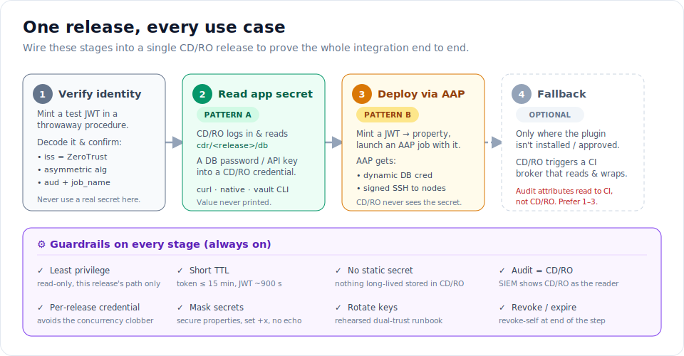
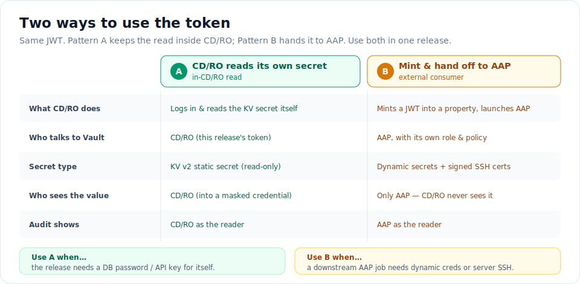
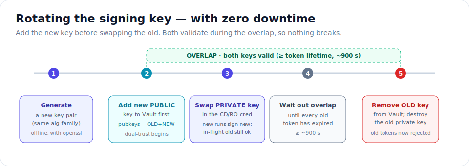
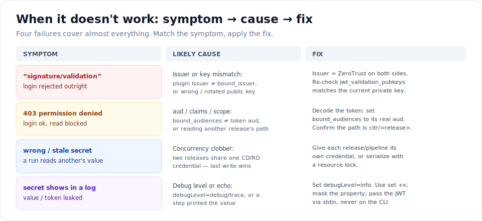

# 02 — Run a Release Across Every Use Case

**Goal:** wire **one** CD/RO release that exercises the whole integration — read a secret for itself
(Pattern A), hand a token to AAP for dynamic secrets and server SSH (Pattern B), rotate the signing
key safely, and fall back gracefully where the plugin isn't available.

You must finish **[01 — Configure the ZeroTrust plugin](01-configure-zerotrust-plugin.md)** first;
this guide *uses* the trust you built there.

> **👀 Explorer — the one idea.** Think of the release as a relay. It picks up a short-lived token,
> uses it to grab the one secret it needs, then passes a fresh token to AAP so AAP can do the heavy
> lifting on the servers. Every leg is short, scoped, and logged.

**Tracks:** 👀 Explorer — pictures + callouts. 🔧 Operator — the numbered stages & copy-paste.
⚙️ Engineer — the deep-dive boxes and the [reference guide](../vault-integrations/03-cdro-zerotrust-jwt.md).

---

## The release at a glance



> **👀 Explorer:** four stages, left to right. Stage 1 proves the token works. Stage 2 grabs a secret
> the release needs. Stage 3 hands off to AAP to reach dynamic secrets and log into servers. Stage 4 is
> a spare tire — only used if the plugin isn't available. The purple band is the set of safety rules
> that apply to *all* of them.

**🔧 Operator — build these four stages into a single release** (each is a procedure or task):

| Stage | Procedure step(s) | Covered in |
|---|---|---|
| 1 · Verify identity | mint a test JWT, decode with `inspect_jwt_claims.py` | [guide 01, Step 2](01-configure-zerotrust-plugin.md#step-2--capture-one-real-token-and-confirm-its-claims) |
| 2 · Read app secret (Pattern A) | `IssueJwtAndStoreInProperty` + a read step | Use case 1 below |
| 3 · Deploy via AAP (Pattern B) | `IssueJwtAndStoreInProperty` + `AnsibleTower` launch | Use case 2 below |
| 4 · Fallback (optional) | CI-broker trigger + unwrap | Use case 3 below |

---

## The two patterns, side by side

Stages 2 and 3 are the same token used two different ways. Know which is which:



---

## Use case 1 — Read the app's own secret (Pattern A)

The everyday case: the release needs a DB password or API key that lives at
`secret/data/cdr/<release>/…`. The plugin logs in and reads it into a CD/RO credential. **The value is
never printed**, and the audit log shows **CD/RO** as the reader.

> **👀 Explorer:** the release asks Vault for *its* password, gets it, uses it, and the token expires.
> You never see the password in a log.

**🔧 Operator — pick one tier** (all three end the same way):

| Tier | For | Needs on the agent | Template |
|---|---|---|---|
| **1 · curl** *(recommended default)* | copy-paste | `curl` | [`cdro-zerotrust-curl.sh`](../vault-integrations/examples/cdro-zerotrust-curl.sh) |
| **2 · native plugin** | no scripting at all | *nothing* — the plugin does the HTTP | [`cdro-zerotrust-native.dsl`](../vault-integrations/examples/cdro-zerotrust-native.dsl) |
| **3 · vault CLI** | scripted automation | `vault` + `jq` | [`cdro-zerotrust-cli.sh`](../vault-integrations/examples/cdro-zerotrust-cli.sh) |

**Tier 2 (native, no CLI)** covers three procedures with no shell binaries:

- **`UpdateCdroCredentialThroughJwtRequest`** — reads a KV secret into an existing credential.
  Mapping: 1 pair → key=username / value=password; 2 pairs `{username,password}` → mapped directly;
  more than 2 → the whole secret stored as JSON in the password field.
- **`getCdroCredentialAndRunStep`** — stores the secret (JSON) in a credential named `zt_credential`,
  then runs your shell / `ec-groovy` command, which reads it via `getFullCredential(...)`.
- **`getAuthorizedTokenAndRunStep`** — stores the **Vault-authorized token** in `zt_credential`, then
  runs a command that calls Vault itself.

A minimal **Tier 1 (curl)** read step (JWT already minted to `/myJob/jwtToken`):

```bash
set -eu; set +x                                  # never trace the token or the secret
export VAULT_ADDR="https://<vault-vip>:8200"
export VAULT_NAMESPACE="AUT"; export VAULT_CACERT="/etc/pki/vault/ca.crt"
RELEASE='$[/myRelease/name]'

VAULT_TOKEN=$(curl -sS --fail --cacert "$VAULT_CACERT" \
    -H "X-Vault-Namespace: $VAULT_NAMESPACE" -X POST --data @- \
    "$VAULT_ADDR/v1/auth/jwt-cdro/login" <<EOF |
{"role":"cdro-zerotrust","jwt":"$[/myJob/jwtToken]"}
EOF
    grep -o '"client_token":"[^"]*"' | head -1 | cut -d'"' -f4)

DB_PASS=$(curl -sS --fail --cacert "$VAULT_CACERT" \
    -H "X-Vault-Namespace: $VAULT_NAMESPACE" -H "X-Vault-Token: $VAULT_TOKEN" \
    "$VAULT_ADDR/v1/secret/data/cdr/${RELEASE}/db" \
    | grep -o '"password":"[^"]*"' | head -1 | cut -d'"' -f4)
echo "Fetched secret (length=${#DB_PASS}) — value not printed."

curl -sS --cacert "$VAULT_CACERT" -H "X-Vault-Namespace: $VAULT_NAMESPACE" \
    -H "X-Vault-Token: $VAULT_TOKEN" -X POST \
    "$VAULT_ADDR/v1/auth/token/revoke-self" >/dev/null 2>&1 || true
```

> **⚙️ Deep-dive — the concurrency clobber (the #1 Pattern A trap).** The native procedures write into a
> **shared** CD/RO credential (e.g. `zt_credential`). Two runs from **different** releases that share one
> credential **overwrite each other** — last write wins, so a run can read the *wrong* secret and fail.
> **Give each release/pipeline its own credential**, or serialize with a resource lock. Concurrent runs
> of the *same* source (same secret) are safe. Full detail:
> [reference guide §9](../vault-integrations/03-cdro-zerotrust-jwt.md#9-limitations-risks--non-functional-notes).

**✅ Use case 1 verify:** a run of `payments-app` reads `secret/data/cdr/payments-app/db`; the same role
pointed at `secret/data/cdr/billing-app/db` returns **403 permission denied** (release scoping holds).
Full walkthrough: [`../getting-started/03-cloudbees-cdro.md` Step 5](../getting-started/03-cloudbees-cdro.md#step-5--usage-pattern-a-read-a-secret-inside-cdro).

---

## Use case 2 — Hand off to AAP (Pattern B)

Sometimes CD/RO **shouldn't** read the secret — a downstream **AAP** job needs a **dynamic** secret
(a just-in-time DB credential) or must **SSH into servers**. CD/RO mints a JWT and lets AAP do its own
Vault exchange. CD/RO's KV-only limit is on *its own* reads; handing off the JWT lifts that limit.

> **👀 Explorer:** CD/RO writes a fresh signed note and passes it to AAP. AAP walks up to Vault with the
> note, gets a *dynamic* password that only lives for the job, and logs into the servers with a
> short-lived SSH certificate. CD/RO never handles any of those secrets.

**🔧 Operator — three moves:**

**1) Mint the JWT into a property** with the plugin's `IssueJwtAndStoreInProperty`, carrying only the
claims AAP needs:

```
IssueJwtAndStoreInProperty:
  configuration : vault-aut
  customClaims  : {"sub":"aap_job","aap_runner":"$[/myPipelineRuntime/runnerIps]"}
  property      : /myPipelineRuntime/jwtToken
```

**2) Launch the AAP job template** with the token as a parameter (the `AnsibleTower` plugin step):

```
AnsibleTower → Launch Job Template:
  extraVars : {"jwt":"$[/myPipelineRuntime/jwtToken]"}
```

**3) AAP exchanges the JWT itself** — its own role, mount, and policy (including **dynamic** engines and
**signed SSH**). The AAP side is built in **[`../getting-started/04-aap-approle-ssh.md`](../getting-started/04-aap-approle-ssh.md)**.

> **⚙️ Deep-dive — treat the property as a bearer credential.** The JWT is a live credential for those
> claims and TTL. Mark `/myPipelineRuntime/jwtToken` **secure/masked**, never echo it, and scope its
> `customClaims` and `Token lifetime` as tightly as the job needs. The AAP job's Vault role must bind the
> same `aud` and the hand-off claims. Full pattern:
> [reference guide §6](../vault-integrations/03-cdro-zerotrust-jwt.md#6-usage-pattern-b--mint-and-hand-off-external-consumer--dynamic-secrets).

**✅ Use case 2 verify:** the AAP job authenticates to Vault with the handed-off JWT and resolves its
secret / signs its SSH cert; the CD/RO job log contains **no** secret value — only the (masked) token
reference.

---

## Ongoing use case — Rotate the signing key (zero downtime)

The plugin's signing key is **not** rotated automatically. Because Vault validates against a *static*
public key, rotation is a **coordinated, two-place** change. Done in this order, there's **no outage**:



> **👀 Explorer:** you add the new lock before you take the old one away. For a little while both keys
> work, so nothing in flight breaks. Once everything old has expired, you remove the old key.

**🔧 Operator:**

```bash
# 1) Generate a new pair offline (same alg family) — same commands as guide 03a.
openssl genpkey -algorithm RSA -pkeyopt rsa_keygen_bits:3072 -out zerotrust-private-NEW.pem
openssl pkey -in zerotrust-private-NEW.pem -pubout -out zerotrust-pub-NEW.pem

# 2) Add the NEW public key to Vault FIRST (dual-trust window: both validate).
vault write auth/jwt-cdro/config \
    jwt_validation_pubkeys="$(cat zerotrust-pub-OLD.pem zerotrust-pub-NEW.pem)" \
    bound_issuer="ZeroTrust"

# 3) Swap the PRIVATE key in the CD/RO Credential referenced by the plugin config.
#    New runs sign with NEW; in-flight OLD tokens still validate.

# 4) After the overlap (>= Token lifetime, ~900 s), remove the OLD public key.
vault write auth/jwt-cdro/config \
    jwt_validation_pubkeys=@zerotrust-pub-NEW.pem bound_issuer="ZeroTrust"
```

> **⚙️ Deep-dive:** `jwt_validation_pubkeys` accepts **multiple** PEMs — that's what makes the overlap
> possible. Log/ticket the rotation, re-confirm the signing Credential's ACL, and destroy the old
> private key once retired. Rehearse it before you need it. Runbook:
> [reference guide §7](../vault-integrations/03-cdro-zerotrust-jwt.md#7-manual-key-rotation).

**✅ Rotation verify:** during the overlap, both old and new tokens log in; after cleanup, a token signed
with the **old** key is **rejected**.

---

## Fallback use case — CI broker (only when the plugin can't be used)

Keep this only for environments where the ZeroTrust plugin isn't installed/approved yet, or as a
migration bridge. Here CD/RO has **no identity of its own**: it triggers a CI **broker** job that reads
the secret with **CI's** OIDC identity and returns it response-wrapped; CD/RO unwraps it just in time.

> **⚠️ The tradeoff you accept:** Vault audit attributes the read to the **CI broker**, not CD/RO — which
> is exactly what the direct ZeroTrust flow avoids. **Prefer use cases 1–2.** Full broker procedure
> (trigger, wrap, unwrap, broker role/policy):
> [reference guide §10](../vault-integrations/03-cdro-zerotrust-jwt.md#10-fallback-cdro-secrets-via-the-ci-broker-interim--where-the-plugin-cant-be-used).

---

## Full end-to-end verification

Run the whole release once and confirm:

- [ ] Stage 1: a test JWT decodes to `iss=ZeroTrust`, an asymmetric `alg`, your `aud`, and `job_name=<release>`.
- [ ] `vault read auth/jwt-cdro/config` shows `bound_issuer=ZeroTrust`, a static pubkey, and **no** discovery URL.
- [ ] Stage 2: `payments-app` reads `cdr/payments-app/db`; another release's path returns **403**.
- [ ] Stage 3: the AAP job resolves its (dynamic) secret and SSHes to a node with a signed cert.
- [ ] SIEM shows the KV read under the **CD/RO** identity with policy `cdro-zerotrust-ro` — not a CI broker.
- [ ] No secret value appears in any CD/RO job log or property.
- [ ] Rotating the key (above) causes **no** run failures during the overlap window.

---

## When it doesn't work

Four failures cover almost everything. Match the symptom, apply the fix:



> **⚙️ Deep-dive — full safeguards & limitations** (concurrency, coarse `sub`, KV-v2-only for Pattern A,
> `debugLevel` risks, over-broad roles): [reference guide §9 and Safeguards](../vault-integrations/03-cdro-zerotrust-jwt.md#9-limitations-risks--non-functional-notes).
> Deeper troubleshooting for all three platforms:
> [`../getting-started/05-verify-and-troubleshoot.md`](../getting-started/05-verify-and-troubleshoot.md).

---

## You've run the whole integration

One release now proves every CD/RO ⇄ Vault use case: it reads its own secret, hands off to AAP for
dynamic secrets and server SSH, rotates its keys with no downtime, and knows its fallback — all with
short-lived, scoped, audited-as-CD/RO access and **no static secret anywhere**.

**Where to go next:**
- The AAP side in full → [`../getting-started/04-aap-approle-ssh.md`](../getting-started/04-aap-approle-ssh.md)
- The architect reference (decision records, firewall matrix, TTLs) → [`../vault-integrations/`](../vault-integrations/)
