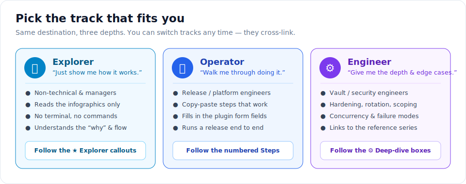
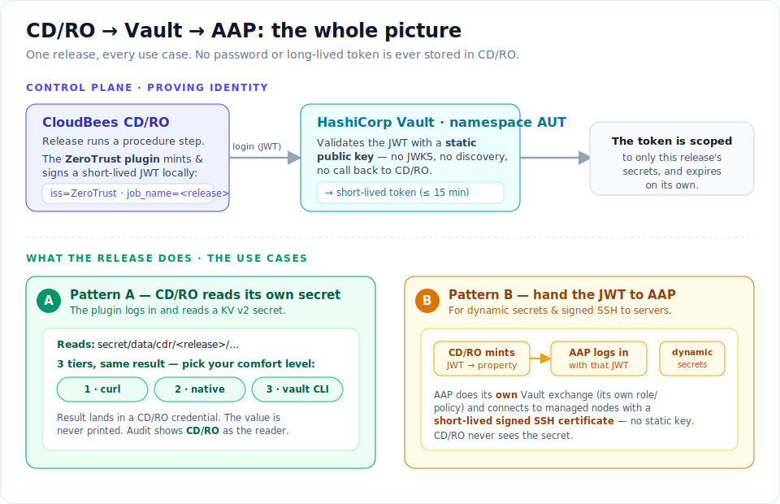

# CD/RO + Vault: Visual User Guides

**Configure the CloudBees CD/RO ZeroTrust plugin, then run one release that exercises every
CD/RO ⇄ Vault use case — including the hand-off to Ansible Automation Platform (AAP).**

These guides are **infographic-first**. Every concept has a picture, and the pictures come first.
They are written for a mixed audience: someone who just wants to *understand* the flow, someone who
has to *build* it, and someone who has to *harden and operate* it. Pick your track and go.

---

## Pick your track

| Track | You are… | Read the… | Skip the… |
|---|---|---|---|
| 👀 **Explorer** | non-technical, a manager, or new to Vault | infographics + the **👀 Explorer** callouts | commands |
| 🔧 **Operator** | building the integration | numbered **Steps** and the copy-paste blocks | deep-dive boxes if short on time |
| ⚙️ **Engineer** | hardening / operating it | **⚙️ Deep-dive** boxes + the [reference series](../vault-integrations/) | nothing |

Throughout both guides, look for these markers:

- **👀 Explorer** — plain-language "what this means, in one breath."
- **Step N** — a concrete thing to do, with exactly what you should see back.
- **⚙️ Deep-dive** — the hardening, edge cases, and links to the architect-level docs.

---

## The whole picture (start here, whatever your track)

> **👀 Explorer — in one breath.** CD/RO proves *who it is* with a short-lived signed token (a
> **JWT**) that the **ZeroTrust plugin** creates on the spot. Vault checks that token and hands back
> a key that only opens **this release's** secrets and expires in minutes. From there the release can
> either **read its own secret** (Pattern A) or **hand the token to AAP** so AAP can fetch dynamic
> secrets and log into servers with a short-lived SSH certificate (Pattern B). Nothing permanent is
> ever stored, and every access is logged as **CD/RO**.

---

## The two guides

| Guide | What you'll do | Key infographics |
|---|---|---|
| **[01 — Configure the ZeroTrust plugin](01-configure-zerotrust-plugin.md)** | Set up the plugin so CD/RO can mint & sign a JWT, and teach Vault to trust it | signing/validation crux · plugin config fields |
| **[02 — Run a release across every use case](02-release-all-use-cases.md)** | Wire one release that reads a secret (Pattern A), hands off to AAP (Pattern B), rotates keys, and knows the fallback | release pipeline · Pattern A vs B · key rotation · troubleshooting |

Do them in order. Guide 01 builds the trust; guide 02 uses it.

---

## Before you start (all tracks)

You need three things in place. If any is missing, the guide tells you where to get it.

1. **Vault namespace `AUT` exists**, with a KV v2 store. → [`../getting-started/01-vault-setup.md`](../getting-started/01-vault-setup.md)
2. **The ZeroTrust plugin is installed** in CD/RO (a CD/RO admin does this).
3. **A signing key pair** for the plugin. → [`../getting-started/03a-zerotrust-key-generation.md`](../getting-started/03a-zerotrust-key-generation.md)
   (2 minutes with `openssl`: the **private** key goes into CD/RO, the **public** key into Vault.)

> **👀 Explorer:** you don't need any of these to *read* the guides — only to *do* them. Read on.

### Your confirmed environment

| Component | Version | How it proves itself to Vault |
|---|---|---|
| CloudBees CD/RO | `2024.09.0.176472` (airgapped VMs) | **ZeroTrust plugin** JWT (`iss=ZeroTrust`, static-pubkey) |
| ZeroTrust plugin | `v1.0` | mints & signs the JWT inside a procedure step |
| HashiCorp Vault Enterprise | `1.20.8+ent`, namespace `AUT` | validates offline against a static public key |
| Ansible Automation Platform | `2.4` (controller `4.5.25`) | hardened **AppRole** (receives CD/RO's JWT in Pattern B) |

---

## How this relates to the other docs

- **This series (`cdro-user-guides/`)** — visual, multi-skill, CD/RO-focused. The "see it and do it" layer.
- **[`../getting-started/`](../getting-started/)** — the full beginner walkthrough for *all three* platforms
  (CI, CD/RO, AAP), copy-paste, airgap-aware. Guide 02 here links into it for the AAP side.
- **[`../vault-integrations/`](../vault-integrations/)** — the architect reference: decision records,
  firewall matrices, TTL tables, and the CI-broker fallback in full. The **⚙️ Deep-dive** boxes link here.

> These guides use placeholders — `<vault-vip>`, `AUT`, `payments-app`, `cdr/<release>` — swap in your
> real values. No secret appears in any file.
